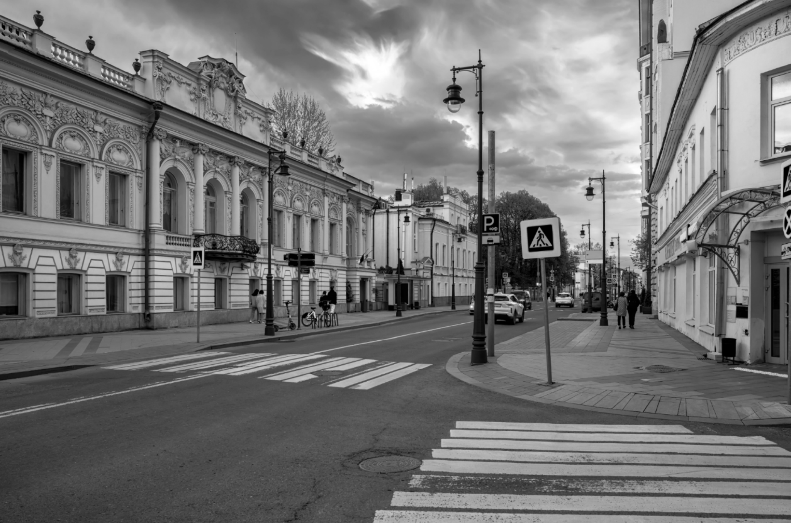
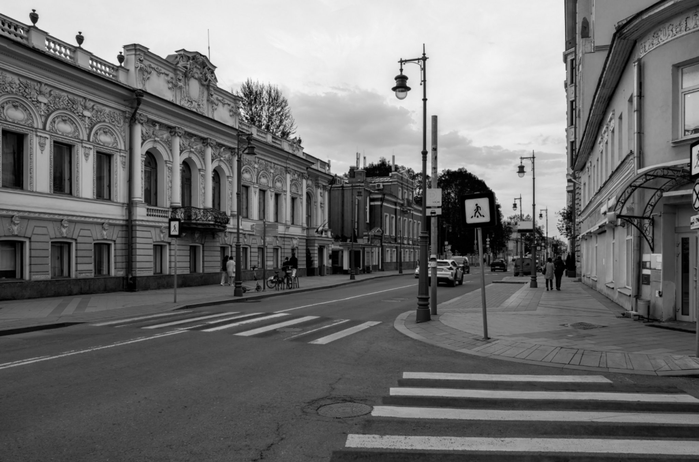
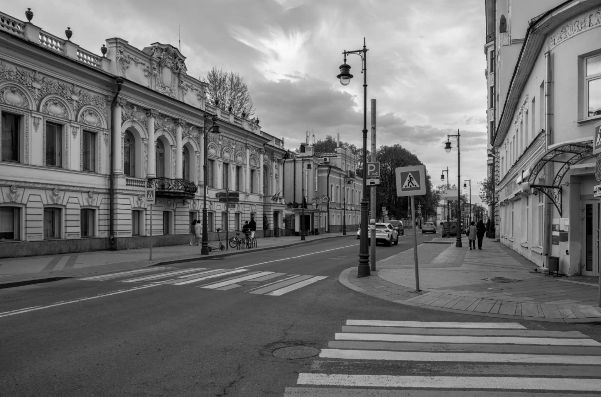
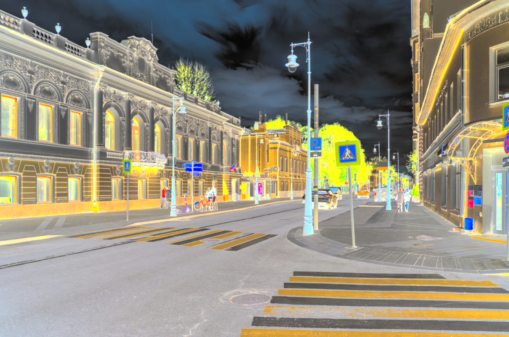
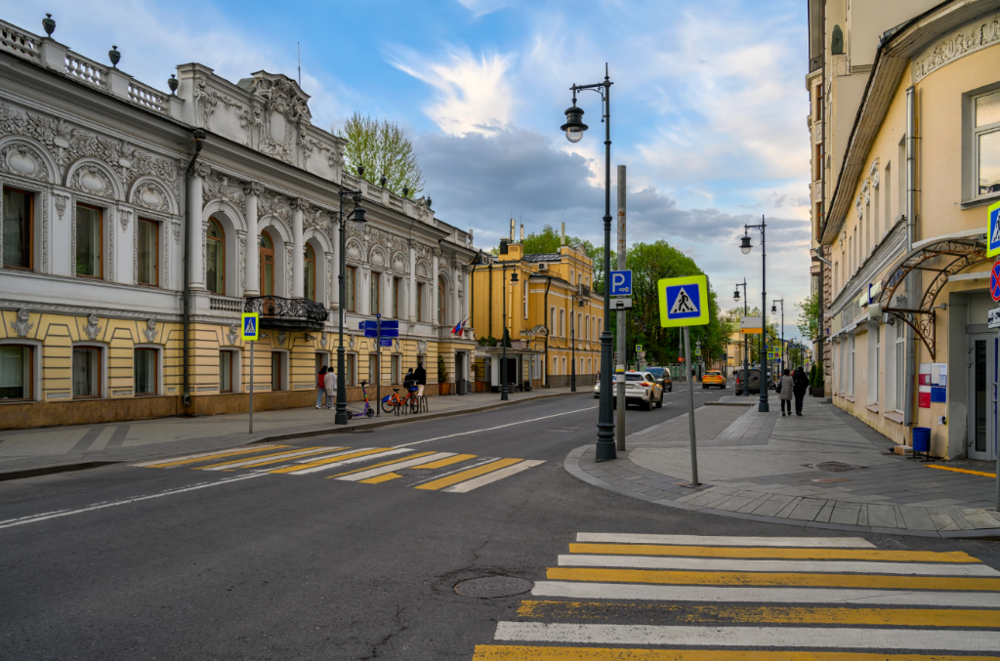

# Лабораторная работа №1
## Цветовые модели и передискретизация изображений

### Цель работы

Изучить цветовые модели RGB и HSI, выделить отдельные компоненты изображения, а также реализовать алгоритмы передискретизации (растяжение, сжатие, двух- и однопроходная передискретизация) без использования библиотечных функций масштабирования.

### Исходное изображение

В качестве исходных данных используется полноцветное трёхканальное изображение `lab1_photo.png` в формате PNG.

### 1. Цветовые модели

#### 1.1 Компоненты R, G, B

На первом этапе исходное изображение было разложено на три канала: красный (R), зелёный (G) и синий (B). Каждый канал сохранён как отдельное полутоновое изображение.

|             Красный канал              |             Зелёный канал              |              Синий канал               |
|:--------------------------------------:|:--------------------------------------:|:--------------------------------------:|
|  |  |  |

По полученным изображениям можно увидеть, какие области сцены вносят наибольший вклад в соответствующий цветовой канал.

#### 1.2 Яркостная компонента HSI

Далее изображение было приведено к цветовой модели HSI. Для этого выполнено преобразование RGB→HSI, после чего выделена яркостная компонента `I` и сохранена как отдельное изображение.

На яркостной компоненте отсутствует цветовая информация, остаётся только распределение яркости по изображению.

#### 1.3 Инвертирование яркостной компоненты

Яркостная компонента `I` была инвертирована по формуле `I' = 1 - I`. Затем по компонентам `H`, `S` и новой яркости `I'` было выполнено обратное преобразование HSI→RGB. В результате получается производное изображение, в котором сохраняются тон и насыщенность, но инвертирована яркость.

|            Исходное изображение            |                  С инвертированной яркостью                   |
|:------------------------------------------:|:-------------------------------------------------------------:|
|  |  |

### 2. Передискретизация (M=1.5, N=2, K=0.75)

Для исследования передискретизации реализованы собственные функции интерполяции и децимации. Библиотечные функции масштабирования не использовались.

#### 2.1 Растяжение в M раз

Растяжение выполнено с коэффициентом `M = 1.5`. Для каждого пикселя выходного изображения его координаты пересчитываются в вещественные координаты исходного изображения, после чего значение цвета вычисляется методом билинейной интерполяции по четырём ближайшим пикселям.

|                  Исходное                  |                   Растянутое                   |
|:------------------------------------------:|:----------------------------------------------:|
|  |  |

#### 2.2 Сжатие в N раз

Сжатие выполнено с коэффициентом `N = 2` путём прореживания отсчётов: выбирается каждый второй пиксель по горизонтали и вертикали. Таким образом реализуется децимация без предварительной фильтрации.

|                  Исходное                  |                    Сжатое                    |
|:------------------------------------------:|:--------------------------------------------:|
|  |  |

#### 2.3 Двухпроходная передискретизация

Для коэффициента `K = M/N = 0.75` передискретизация выполняется в два прохода:

1. растяжение изображения в `M = 1.5` раза методом билинейной интерполяции;
2. сжатие полученного изображения в `N = 2` раза методом прореживания.

|                  Исходное                  |             Результат двух проходов             |
|:------------------------------------------:|:-----------------------------------------------:|
|  |  |

#### 2.4 Однопроходная передискретизация

Во втором варианте передискретизация до того же коэффициента `K = 0.75` выполняется за один проход. Для каждого пикселя выходного изображения находятся соответствующие координаты в исходном изображении, а цвет вычисляется с помощью билинейной интерполяции.

|                  Исходное                  |            Результат одного прохода             |
|:------------------------------------------:|:-----------------------------------------------:|
|  |  |

### Результаты выполнения

Ниже приведены реальные размеры изображений до и после операций.

| Операция | Размер изображения |
|:--|--:|
| Исходное изображение | 2048×1354 |
| Растяжение (M=1.5) | 3072×2031 |
| Сжатие (N=2) | 1024×677 |
| Двухпроходная (растяжение 1.5 + сжатие 2) | 1536×1016 |
| Однопроходная (K=0.75) | 1536×1016 |

### Выводы

1. Выделены компоненты красного, зелёного и синего каналов исходного изображения.
2. Реализовано преобразование RGB→HSI и получена яркостная компонента `I`.
3. Выполнено инвертирование яркостной компоненты и получено изображение с сохранением тона и насыщенности.
4. Реализовано растяжение изображения методом билинейной интерполяции.
5. Реализовано сжатие изображения методом прореживания.
6. Выполнены двухпроходная и однопроходная передискретизация с одинаковым коэффициентом `K = 0.75`.
7. Показано, что при одинаковом итоговом коэффициенте результаты двухпроходной и однопроходной обработки могут отличаться из-за разной последовательности вычислений.
