# Лабораторная работа №4

## Выделение контуров на изображении

### Вариант

Для варианта `16` по таблице задания используется метод **разности исходного и морфологически расширенного изображения** с выводом **черного контура**.

В работе использованы те же два изображения рукописей, что и в предыдущих лабораторных.

### Что делается в работе

1. Загружается исходное цветное изображение.
2. Цветное изображение переводится в полутоновое по формуле `BT.601`.
3. Для подготовки к морфологической обработке строится бинарное изображение методом локального порога `Bradley-Roth`, так как рукописи имеют неравномерный фон.
4. Выполняется морфологическое расширение черных пикселей структурирующим элементом `диск 3 x 3`:

```text
0 1 0
1 1 1
0 1 0
```

5. Контур выделяется как разность между расширенным изображением и исходным бинарным изображением.
6. Результат сохраняется как изображение с **черным контуром на белом фоне**.

### Теория

Пусть `B` — множество черных пикселей исходного бинарного изображения, а `D(B)` — результат его дилатации.

Тогда множество контурных пикселей определяется как:

`C = D(B) \ B`

То есть берутся только те черные пиксели, которые появились после расширения и отсутствовали в исходном изображении. Именно они образуют внешний контур объектов.

### Сводка

| Изображение | Размер | Черных пикселей до | Черных пикселей после дилатации | Контурных пикселей | Доля контура |
| --- | --- | --- | --- | --- | --- |
| `manuscript_01` | `1320 x 2048` | `189751` | `324304` | `134553` | `4.98%` |
| `manuscript_02` | `1314 x 2048` | `394362` | `561844` | `167482` | `6.22%` |

По числам видно, что после дилатации число черных пикселей возрастает, а разностное изображение оставляет только узкую внешнюю границу штрихов и пятен.

### Результаты

#### Изображение `manuscript_01`

| Исходное цветное | Полутоновое |
| --- | --- |
| 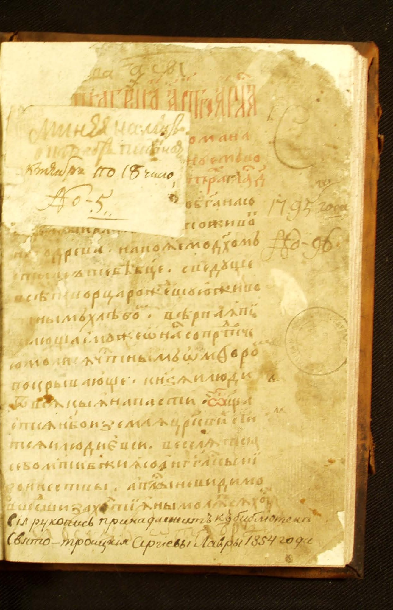 | 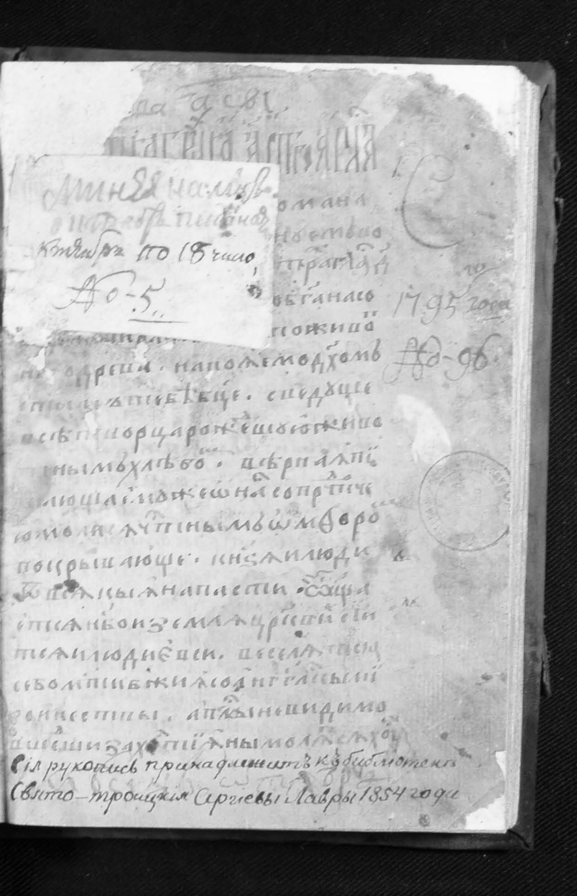 |

| Бинарный вход | После дилатации |
| --- | --- |
| 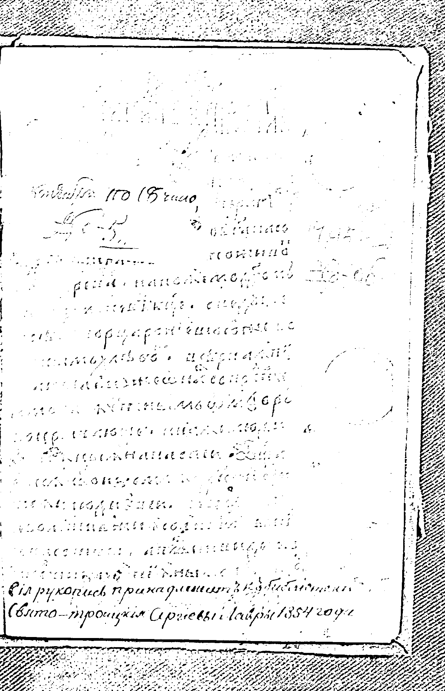 | 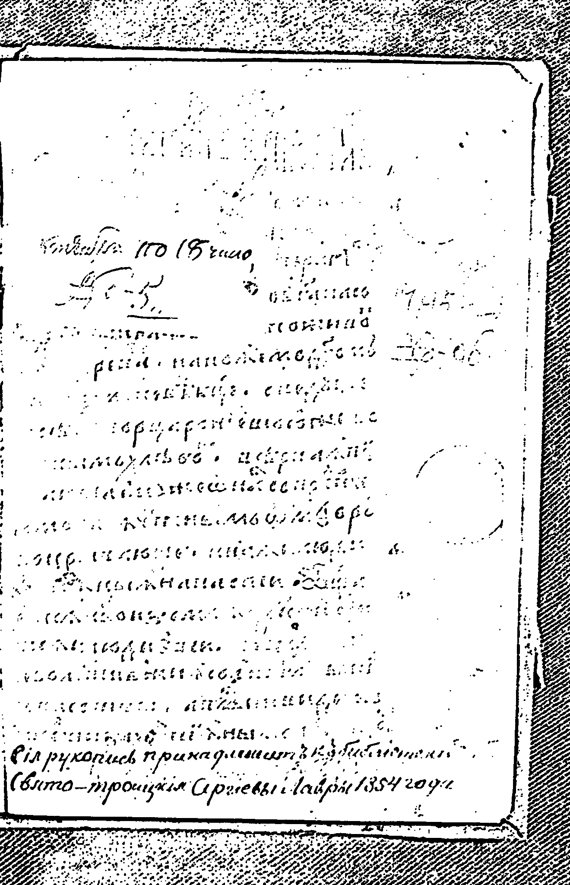 |

Итоговый черный контур:

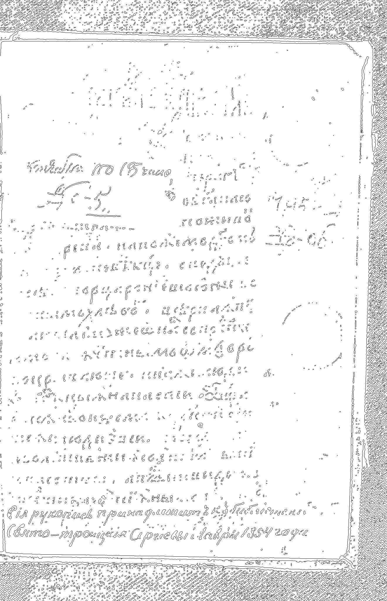

Сводная панель:

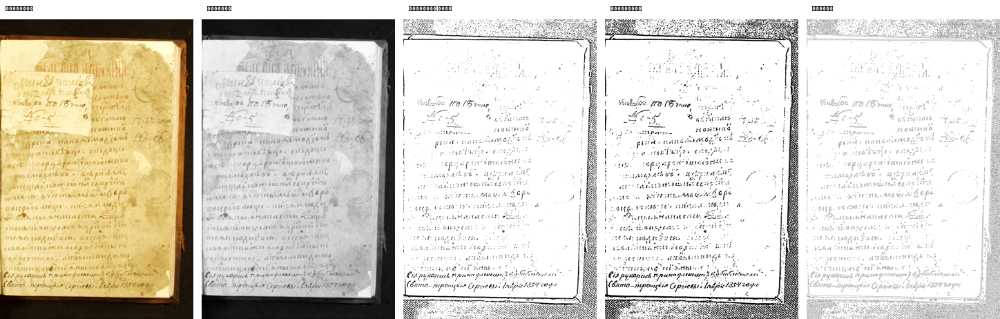

На первой рукописи фон довольно светлый, но присутствуют пятна и слабые штрихи. После дилатации внешний контур получается непрерывным и хорошо подчеркивает границы надписей и загрязнений.

#### Изображение `manuscript_02`

| Исходное цветное | Полутоновое |
| --- | --- |
| 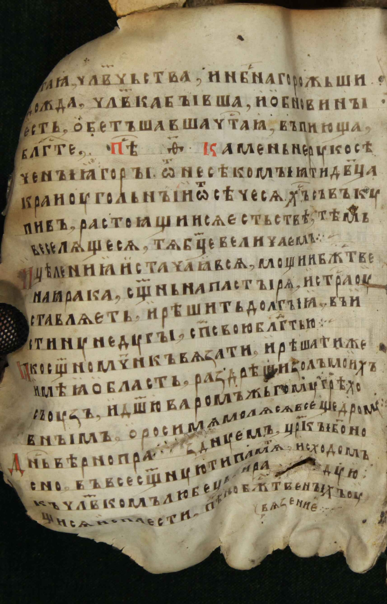 | 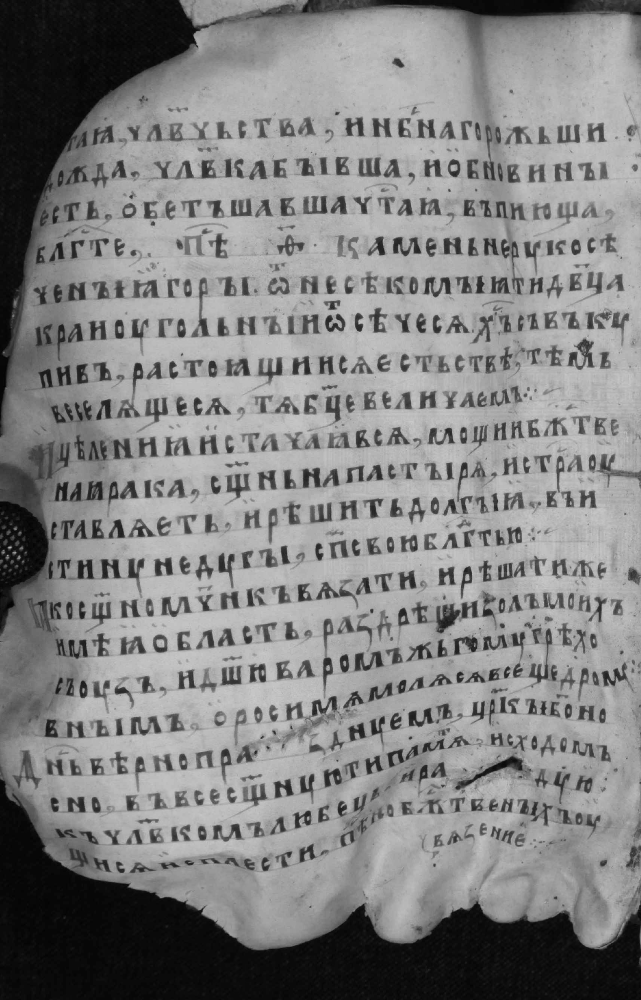 |

| Бинарный вход | После дилатации |
| --- | --- |
| 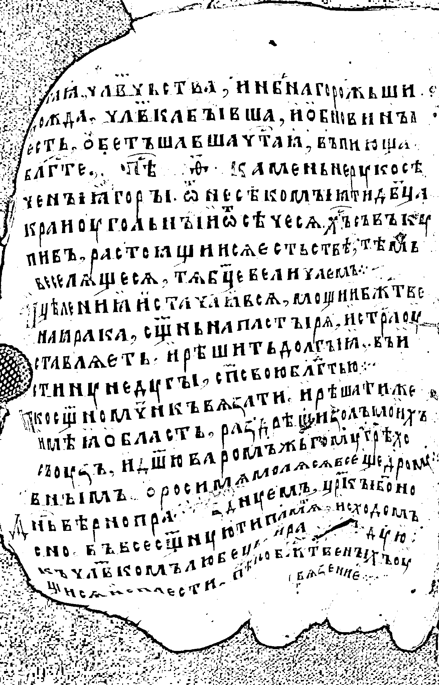 | 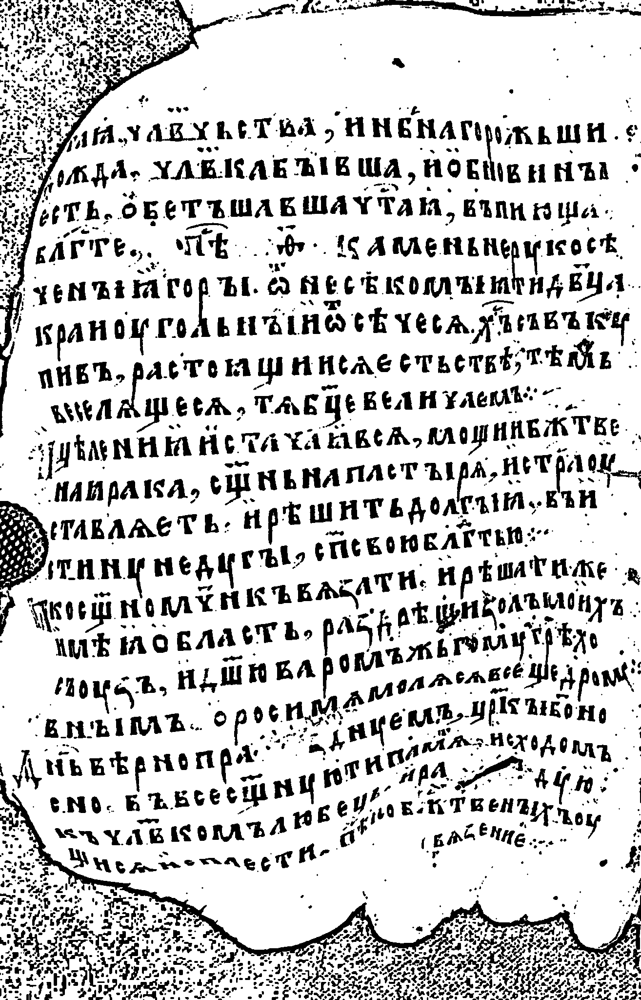 |

Итоговый черный контур:

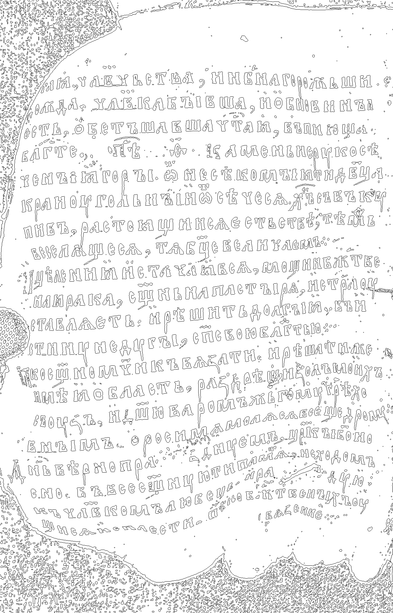

Сводная панель:

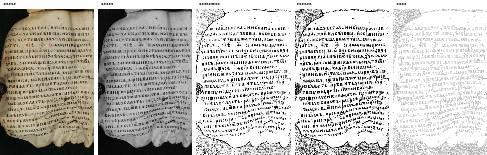

На второй рукописи буквы крупнее и контрастнее, поэтому контур выделяется еще заметнее. Одновременно хорошо проявляются неровные края листа и крупные дефекты поверхности.

### Вывод

В лабораторной работе №4 для варианта `16` выполнено выделение контура методом разности исходного и морфологически расширенного изображения.

Для двух изображений рукописей показаны все основные этапы: исходное цветное изображение, полутоновое представление, бинарный вход, результат дилатации и итоговый черный контур.

Метод дает наглядный внешний контур букв и дефектов страницы. Он особенно удобен для текстовых и документных изображений, где нужно подчеркнуть форму темных объектов на светлом фоне.