# Лабораторная работа №5
## Выделение признаков символов
### Вариант 16
Для варианта `16` по таблице задания выбраны **казахские заглавные буквы**:
`АӘБВГҒДЕЁЖЗИЙКҚЛМНҢОӨПРСТУҰҮФХҺЦЧШЩЪЫІЬЭЮЯ`
Всего сгенерировано `42` эталонных изображений символов.
### Что сделано в работе
1. Сгенерированы эталонные изображения всех символов выбранного алфавита.
2. Белые поля автоматически обрезаны по рамке чёрных пикселей.
3. Каждый символ сохранён по принципу `1 символ = 1 файл`.
4. Для каждого изображения вычислены признаки из задания.
5. Скалярные признаки сохранены в `CSV` с разделителем `;`.
6. Профили `X` и `Y` сохранены в `PNG` в виде столбчатых диаграмм.
### Исходные данные
| Параметр | Значение |
| --- | --- |
| Алфавит | Казахские заглавные буквы |
| Шрифт | `DejaVuSans.ttf` |
| Размер шрифта | `72` |
| Количество символов | `42` |
| Папка эталонов | `lab5/source_symbols` |
| Папка результатов | `lab5/results` |
| Скалярные признаки | `lab5/results/summary.csv` |

### Теория
В работе используется бинарное изображение символа:

`f(x, y) ∊ {0, 1}`

где `1` соответствует чёрному пикселю символа, а `0` соответствует белому фону.

#### 1. Вес и удельный вес четвертей

Вес символа соответствует нулевому моменту:

`m00 = ΣΣ f(x, y)`

Изображение делится на четыре четверти: верхнюю левую, верхнюю правую, нижнюю левую и нижнюю правую. Для каждой четверти вычисляются вес чёрных пикселей и удельный вес, то есть отношение веса к площади четверти.

#### 2. Центр тяжести

Координаты центра тяжести вычисляются через моменты первого порядка:

`xc = m10 / m00`, `yc = m01 / m00`

Нормированные координаты получаются делением `xc` на ширину изображения, а `yc` — на высоту изображения.

#### 3. Осевые моменты инерции

Осевые моменты инерции показывают распределение чёрных пикселей относительно центра тяжести. Чем больше момент, тем сильнее форма символа вытянута вдоль соответствующего направления.

#### 4. Профили X и Y

Профиль `X` — это сумма чёрных пикселей по каждому столбцу изображения. Профиль `Y` — сумма чёрных пикселей по каждой строке. Эти признаки позволяют описать структуру символа как набор вертикальных и горизонтальных распределений.

### Алгоритм выполнения

1. Задаётся строка символов казахского алфавита для варианта 16.
2. Для каждого символа строится отдельное бинарное изображение.
3. Белые поля автоматически обрезаются по рамке чёрных пикселей.
4. Эталон сохраняется в `lab5/source_symbols`.
5. Для каждого символа вычисляются скалярные признаки.
6. Строятся профили `X` и `Y`.
7. Формируется общая галерея и итоговый `CSV`.

Для каждого символа сохраняются:

- `00_symbol.png` — бинарное изображение символа;
- `01_profile_x.png` — профиль `X`;
- `02_profile_y.png` — профиль `Y`.

### Сводка по всему алфавиту

#### Общая галерея эталонов

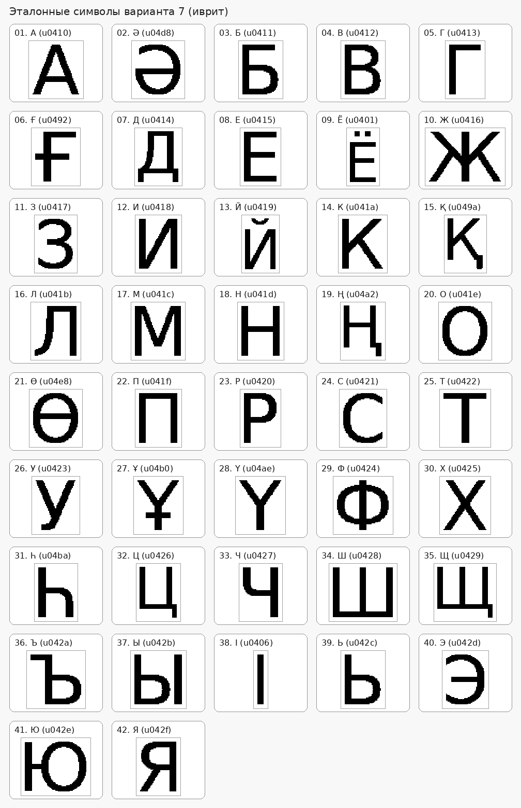

#### Сводные наблюдения

| Признак | Минимум | Максимум |
| --- | --- | --- |
| Общий вес | `І` — `364` | `Ю` — `1522` |
| Ширина | `І` — `11` | `Ж` — `79` |
| Высота | `А` — `56` | `Ё` — `70` |
| xc_norm | `Г` — `0.276389` | `Ч` — `0.599111` |
| yc_norm | `Т` — `0.354488` | `Ь` — `0.606983` |
| Ix_norm | `Ү` — `48.313861` | `Ё` — `139.196655` |
| Iy_norm | `І` — `2.363636` | `Ю` — `174.480402` |

Полный набор признаков для всех `42` символов сохранён в `lab5/results/summary.csv`.

### Подробные примеры

Ниже показаны несколько характерных символов. Полные результаты по всем символам лежат в `lab5/results/<symbol_id>/`.

#### Символ `А`

Эталонное изображение:

Профиль `X`:

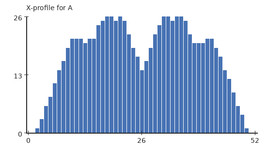

Профиль `Y`:

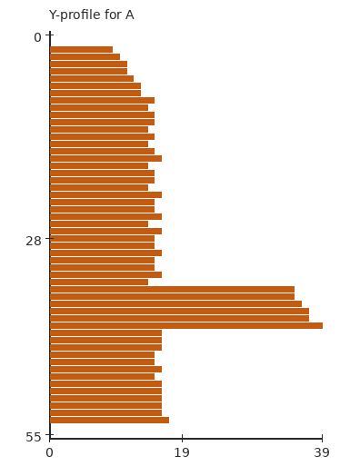

- Размер: `53 x 56`
- Вес: `893`
- Нормированный центр тяжести: `xc = 0.501723`, `yc = 0.544335`
- Нормированные моменты инерции: `Ix = 58.612403`, `Iy = 41.980739`

#### Символ `Ә`

Эталонное изображение:

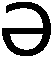

Профиль `X`:

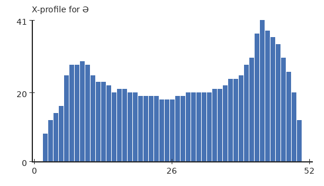

Профиль `Y`:

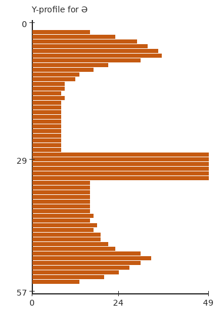

- Размер: `53 x 58`
- Вес: `1120`
- Нормированный центр тяжести: `xc = 0.533929`, `yc = 0.518656`
- Нормированные моменты инерции: `Ix = 92.706408`, `Iy = 74.112483`

#### Символ `Қ`

Эталонное изображение:

Профиль `X`:

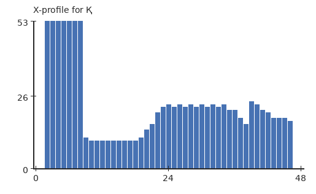

Профиль `Y`:

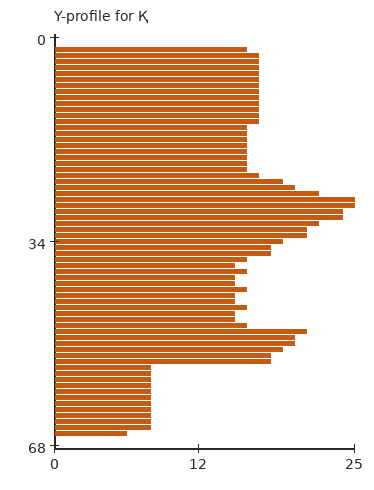

- Размер: `49 x 69`
- Вес: `1038`
- Нормированный центр тяжести: `xc = 0.434670`, `yc = 0.457823`
- Нормированные моменты инерции: `Ix = 89.439491`, `Iy = 62.751212`

#### Символ `Ұ`

Эталонное изображение:

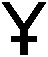

Профиль `X`:

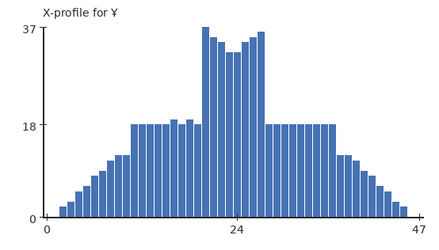

Профиль `Y`:

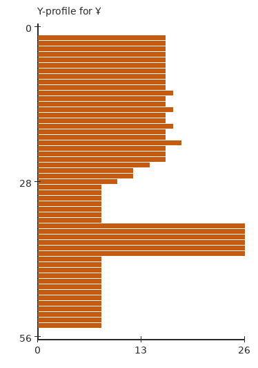

- Размер: `48 x 57`
- Вес: `737`
- Нормированный центр тяжести: `xc = 0.499524`, `yc = 0.458592`
- Нормированные моменты инерции: `Ix = 57.627218`, `Iy = 23.370570`

#### Символ `І`

Эталонное изображение:

Профиль `X`:

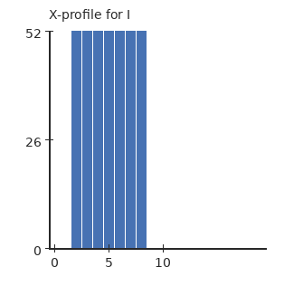

Профиль `Y`:

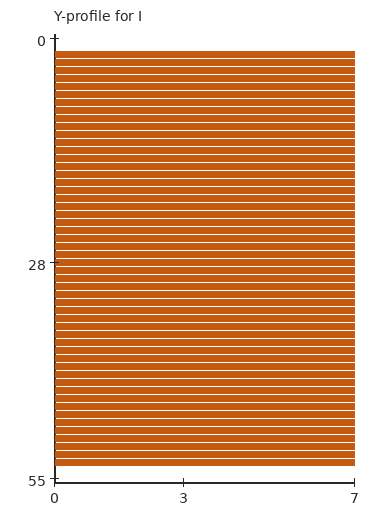

- Размер: `11 x 56`
- Вес: `364`
- Нормированный центр тяжести: `xc = 0.500000`, `yc = 0.500000`
- Нормированные моменты инерции: `Ix = 133.102273`, `Iy = 2.363636`

### Вывод

В лабораторной работе сгенерированы эталонные изображения всех казахских заглавных букв, выполнена автоматическая обрезка белых полей и вычислен полный набор признаков, требуемых заданием.

Для каждого символа сохранены эталонное изображение, профили `X` и `Y`, а также скалярные признаки в общем `CSV`-файле. По результатам видно, что набор признаков хорошо описывает геометрию букв: вес отражает площадь чёрного, центр тяжести показывает смещение формы, моменты инерции фиксируют вытянутость, а профили дают распределение пикселей по строкам и столбцам.
