# Лабораторная работа №6

## Сегментация текста

### Вариант 16

Для варианта `16` выбран алфавит: **казахские заглавные буквы**.

Алфавит:

`А Ә Б В Г Ғ Д Е Ё Ж З И Й К Қ Л М Н Ң О Ө П Р С Т У Ұ Ү Ф Х Һ Ц Ч Ш Щ Ъ Ы І Ь Э Ю Я`

В качестве исходной строки используется монохромное изображение романтической фразы:

`МЕН СЕНІ ЖАҚСЫ КӨРЕМІН`

Перевод фразы: `Я тебя люблю`.

### Что сделано в работе

1. Сгенерировано исходное монохромное изображение строки в формате `BMP`.
2. Изображение обрезано по границам текста, без большого белого поля вокруг строки.
3. Реализованы алгоритмы расчета вертикального и горизонтального профилей.
4. Реализовано выделение текстовой области по профилям.
5. Реализована сегментация символов строки по вертикальному профилю с прореживанием ложных границ.
6. Для каждого найденного символа сохранен вырезанный фрагмент.
7. Построены профили `X` и `Y` для всех символов выбранного алфавита.
8. Результаты сохранены в `CSV` с разделителем `;`.

### Исходные данные

| Параметр | Значение |
| --- | --- |
| Вариант | `16` |
| Алфавит | `казахские заглавные буквы` |
| Количество символов в алфавите | `42` |
| Фраза | `МЕН СЕНІ ЖАҚСЫ КӨРЕМІН` |
| Шрифт | `NotoSans-Regular.ttf` |
| Размер шрифта | `72` |
| Размер исходного BMP | `952 x 66` |
| Папка результатов | `lab6_variant16/results` |

### Теория

В работе изображение рассматривается как бинарная функция:

`I(x, y) ∊ {0, 1}`

где:

- `1` соответствует черному пикселю символа;
- `0` соответствует белому фону.

#### 1. Профили изображения

Профиль изображения — это сумма черных пикселей вдоль выбранного направления.

Вертикальный профиль по столбцу `x`:

`P_X(x) = Σ_y I(x, y)`

Горизонтальный профиль по строке `y`:

`P_Y(y) = Σ_x I(x, y)`

Вертикальный профиль используется для поиска промежутков между символами, а горизонтальный профиль — для определения верхней и нижней границы строки.

#### 2. Выделение текстовой области

Для выделения общей текстовой области выполняются следующие действия:

1. Строится вертикальный профиль всего изображения.
2. Находятся первый и последний столбцы, в которых значение профиля больше порога.
3. Строится горизонтальный профиль всего изображения.
4. Находятся первая и последняя строки, в которых значение профиля больше порога.
5. Полученные границы формируют прямоугольник текста.

#### 3. Сегментация символов

Сегментация символов выполняется внутри найденной строки. Основой является вертикальный профиль:

- начало символа соответствует переходу профиля от нулевого или малого значения к значению выше порога;
- конец символа соответствует обратному переходу;
- слишком узкие фрагменты объединяются с соседними, чтобы убрать ложные границы.

В программе используется порог профиля `1` и минимальная ширина сегмента `5` пикселей.

### Выполнение

1. Исходная фраза была отрисована выбранным шрифтом и сохранена в файл `kazakh_romantic_phrase_mono.bmp`.
2. Файл загружен как полутоновое изображение и преобразован в бинарный массив.
3. Для исходной строки были построены профили `X` и `Y`.
4. По ненулевым значениям профилей найден общий прямоугольник текста.
5. Внутри текстовой области выполнена сегментация символов.
6. Для каждого символа уточнены верхняя, нижняя, левая и правая границы.
7. Сохранены изображения с прямоугольниками, галерея вырезанных символов и таблица координат.
8. Для всех `42` символов казахского алфавита построены отдельные эталонные изображения и профили.

### Сводка

| Параметр | Значение |
| --- | --- |
| Максимум вертикального профиля | `51` |
| Максимум горизонтального профиля | `469` |
| Символов в строке | `19` |
| Минимальная ширина символа | `19` |
| Максимальная ширина символа | `60` |
| Средняя ширина символа | `38.84` |
| Минимальная высота символа | `51` |
| Максимальная высота символа | `65` |
| Средняя высота символа | `52.05` |
| Минимальный вес символа строки | `467` |
| Максимальный вес символа строки | `1278` |

Самый узкий сегмент — символ `№07` с шириной `19` пикселей. Самый широкий сегмент — символ `№08` с шириной `60` пикселей. Самый высокий сегмент — символ `№10` с высотой `65` пикселей. Минимальный вес имеет символ `№07`, максимальный вес — символ `№01`.

### Результаты сегментации строки

Исходное изображение:

Вертикальный профиль строки:

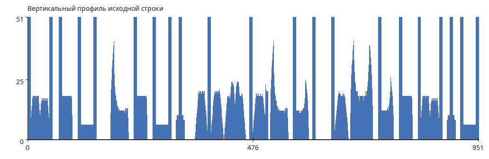

Горизонтальный профиль строки:

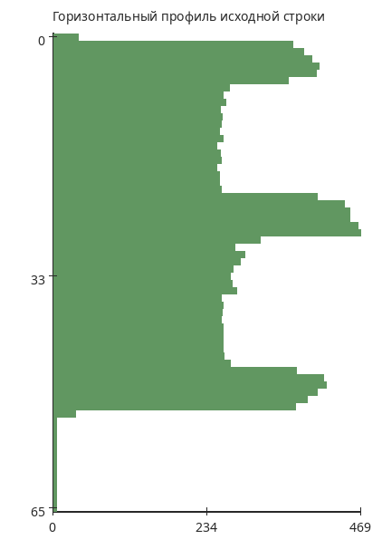

Текстовая область:

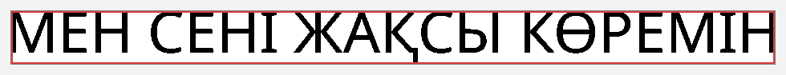

Сегментация символов:

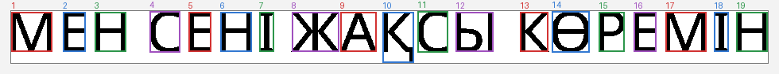

Галерея вырезанных символов:

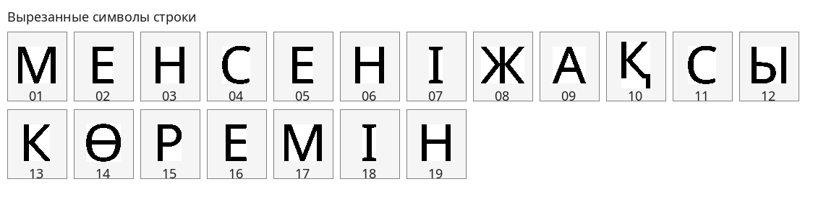

#### Координаты прямоугольников символов

Прямоугольники упорядочены слева направо, сверху вниз.

| № | `x_left` | `y_top` | `x_right` | `y_bottom` | Размер | Вес |
| --- | --- | --- | --- | --- | --- | --- |
| `01` | `0` | `1` | `51` | `51` | `52 x 51` | `1278` |
| `02` | `65` | `1` | `93` | `51` | `29 x 51` | `744` |
| `03` | `105` | `1` | `144` | `51` | `40 x 51` | `870` |
| `04` | `174` | `0` | `212` | `52` | `39 x 53` | `652` |
| `05` | `223` | `1` | `251` | `51` | `29 x 51` | `744` |
| `06` | `263` | `1` | `302` | `51` | `40 x 51` | `870` |
| `07` | `312` | `1` | `330` | `51` | `19 x 51` | `467` |
| `08` | `353` | `1` | `412` | `51` | `60 x 51` | `1152` |
| `09` | `414` | `1` | `459` | `51` | `46 x 51` | `782` |
| `10` | `467` | `1` | `506` | `65` | `40 x 65` | `893` |
| `11` | `511` | `0` | `549` | `52` | `39 x 53` | `652` |
| `12` | `559` | `1` | `606` | `51` | `48 x 51` | `1095` |
| `13` | `640` | `1` | `675` | `51` | `36 x 51` | `782` |
| `14` | `680` | `0` | `727` | `52` | `48 x 53` | `1137` |
| `15` | `739` | `1` | `771` | `51` | `33 x 51` | `739` |
| `16` | `783` | `1` | `811` | `51` | `29 x 51` | `744` |
| `17` | `823` | `1` | `874` | `51` | `52 x 51` | `1278` |
| `18` | `884` | `1` | `902` | `51` | `19 x 51` | `467` |
| `19` | `912` | `1` | `951` | `51` | `40 x 51` | `870` |

### Профили символов выбранного алфавита

Сгенерированы эталонные изображения всех `42` символов казахского алфавита и построены профили `X` и `Y`. Полный набор результатов сохранен в `lab6_variant16/results/alphabet_profiles/`, а сводная таблица — в `lab6_variant16/results/alphabet_summary.csv`.

#### Общая галерея эталонов

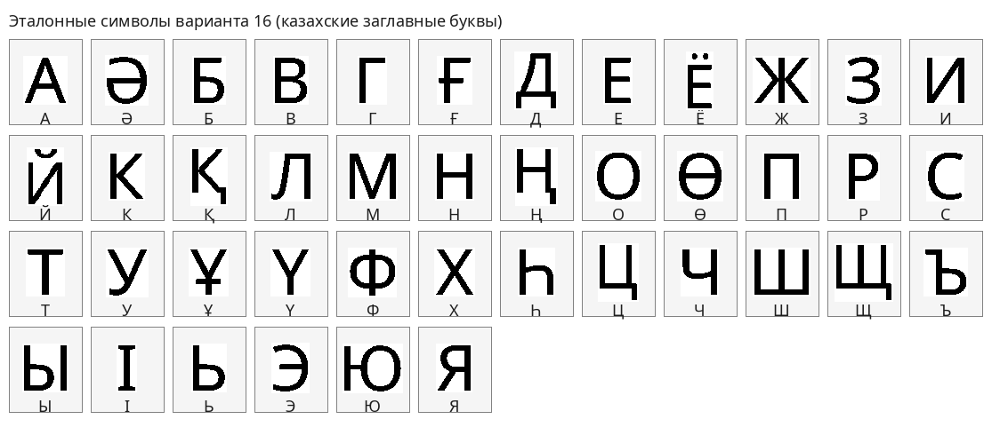

#### Примеры профилей

##### Символ `А`

Эталон:

Профиль `X`:

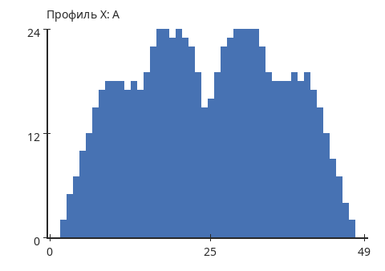

Профиль `Y`:

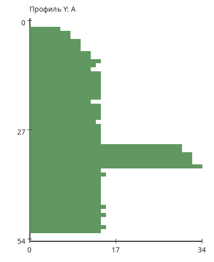

- Размер: `50 x 55`
- Вес: `782`
##### Символ `Ә`

Эталон:

Профиль `X`:

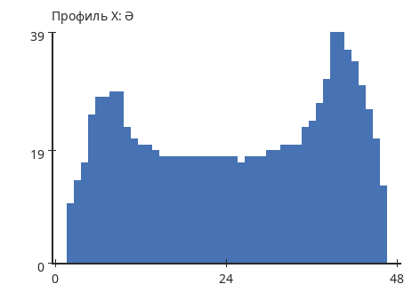

Профиль `Y`:

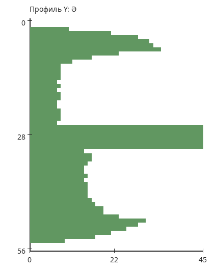

- Размер: `49 x 57`
- Вес: `993`
##### Символ `Қ`

Эталон:

Профиль `X`:

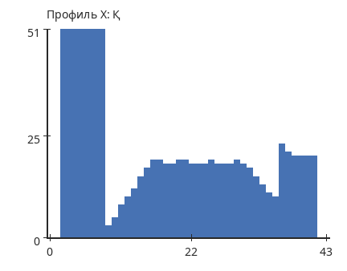

Профиль `Y`:

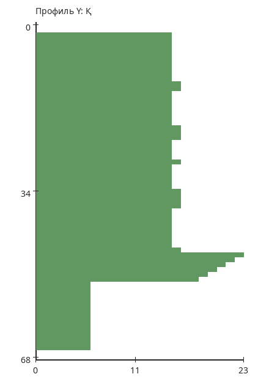

- Размер: `44 x 69`
- Вес: `893`
##### Символ `Ө`

Эталон:

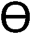

Профиль `X`:

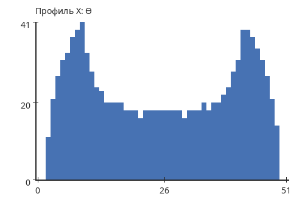

Профиль `Y`:

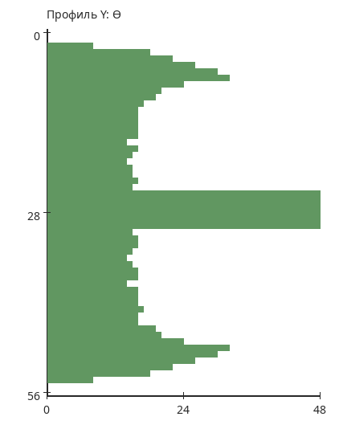

- Размер: `52 x 57`
- Вес: `1137`
##### Символ `І`

Эталон:

Профиль `X`:

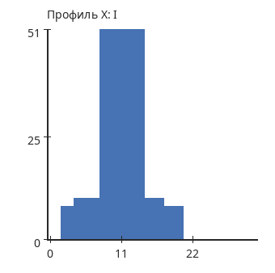

Профиль `Y`:

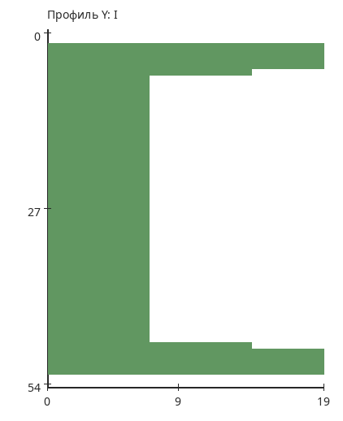

- Размер: `23 x 55`
- Вес: `467`

### Вывод

В ходе лабораторной работы был реализован алгоритм сегментации текстовой строки на отдельные символы на основе анализа горизонтального и вертикального профилей. Для варианта `16` использовался алфавит казахских заглавных букв. Исходная фраза `МЕН СЕНІ ЖАҚСЫ КӨРЕМІН` была представлена в виде монохромного `BMP`-изображения, после чего были найдены границы текстовой области и координаты прямоугольников всех символов.

Дополнительно построены профили `X` и `Y` для всех символов выбранного алфавита. Полученные изображения, таблицы и исходный код сохранены в структуре лабораторной работы.
