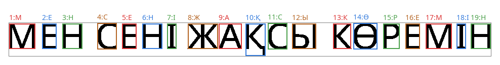
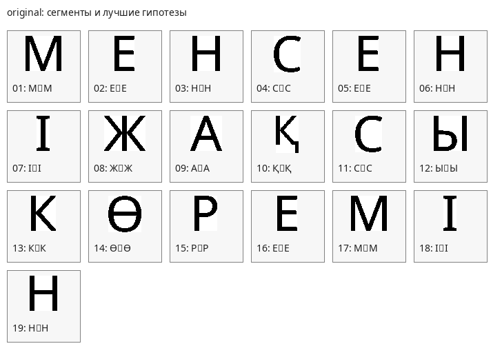
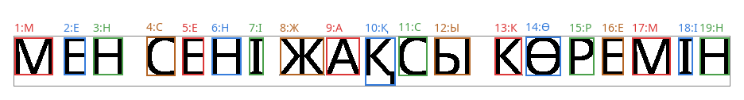
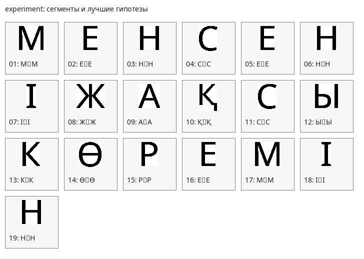

# Лабораторная работа №7

## Классификация на основе признаков, анализ профилей

### Вариант 16

Для варианта `16` используется выбранный ранее алфавит: **казахские заглавные буквы**.

Алфавит:

`А Ә Б В Г Ғ Д Е Ё Ж З И Й К Қ Л М Н Ң О Ө П Р С Т У Ұ Ү Ф Х Һ Ц Ч Ш Щ Ъ Ы І Ь Э Ю Я`

Распознаваемая строка взята из лабораторной работы №6:

`МЕН СЕНІ ЖАҚСЫ КӨРЕМІН`

Сравнение выполняется без пробелов, потому что при сегментации выделяются только изображения символов:

`МЕНСЕНІЖАҚСЫКӨРЕМІН`

### Что сделано в работе

1. Использованы наработки лабораторной работы №6: исходное монохромное изображение строки и алгоритм сегментации по профилям.
2. Для каждого символа алфавита построено эталонное бинарное изображение.
3. Для эталонов и найденных символов рассчитаны признаки: масса, координаты центра тяжести, осевые моменты инерции.
4. Для анализа профилей дополнительно использованы нормированные отсчеты вертикального и горизонтального профилей.
5. Для каждого найденного символа строки рассчитаны меры близости со всеми `42` символами алфавита.
6. Гипотезы распознавания отсортированы по убыванию меры близости.
7. Лучшие гипотезы собраны в итоговую строку.
8. Посчитаны количество ошибок и доля верно распознанных символов.
9. Проведен эксперимент: та же строка с другим размером шрифта.

### Исходные данные

| Параметр | Значение |
| --- | --- |
| Вариант | `16` |
| Алфавит | `казахские заглавные буквы` |
| Количество эталонов | `42` |
| Исходная фраза | `МЕН СЕНІ ЖАҚСЫ КӨРЕМІН` |
| Эталон без пробелов | `МЕНСЕНІЖАҚСЫКӨРЕМІН` |
| Шрифт | `NotoSans-Regular.ttf` |
| Основной размер шрифта | `72` |
| Размер шрифта в эксперименте | `68` |

### Теория

#### 1. Признаковое описание символа

Бинарное изображение символа рассматривается как функция:

`I(x, y) ∊ {0, 1}`,

где `1` соответствует черному пикселю, а `0` — фону.

В работе используется признаковый вектор:

`F = (m, xc, yc, Ix, Iy, px1 ... px16, py1 ... py16)`

Базовые признаки:

- `m` — нормированная масса символа, то есть отношение количества черных пикселей к площади прямоугольника;
- `xc`, `yc` — нормированные координаты центра тяжести;
- `Ix`, `Iy` — нормированные осевые моменты инерции;
- `px1 ... px16` — нормированные отсчеты вертикального профиля;
- `py1 ... py16` — нормированные отсчеты горизонтального профиля.

Координаты центра тяжести вычисляются по формулам:

`xc = m10 / m00`

`yc = m01 / m00`

где:

`m00 = ΣΣ I(x, y)`

`m10 = ΣΣ x I(x, y)`

`m01 = ΣΣ y I(x, y)`

Осевые моменты инерции:

`Ix = ΣΣ (y - yc)^2 I(x, y)`

`Iy = ΣΣ (x - xc)^2 I(x, y)`

Для устойчивости к изменению размера шрифта моменты нормируются относительно массы и размеров изображения символа.

#### 2. Мера близости

Между неизвестным символом `A` и эталонным символом `B` вычисляется евклидово расстояние в пространстве нормализованных признаков:

`d(A, B) = sqrt(Σ(fi(A) - fi(B))^2)`

Мера близости задается формулой:

`S(A, B) = 1 / (1 + d(A, B))`

Если расстояние равно нулю, то мера близости равна единице.

#### 3. Алгоритм классификации

1. Сегментировать строку на отдельные символы.
2. Для каждого сегмента вычислить признаковый вектор.
3. Для каждого сегмента вычислить расстояние до всех эталонов алфавита.
4. Преобразовать расстояние в меру близости.
5. Отсортировать гипотезы по убыванию меры близости.
6. В качестве распознанного символа выбрать первую гипотезу.
7. Сравнить полученную строку с эталоном.

### Сводка результатов

| Параметр | Исходная строка | Эксперимент |
| --- | --- | --- |
| Источник | `kazakh_romantic_phrase_mono.bmp` | Сгенерированное изображение |
| Размер шрифта | `72` | `68` |
| Число эталонов | `42` | `42` |
| Число найденных символов | `19` | `19` |
| Эталон без пробелов | `МЕНСЕНІЖАҚСЫКӨРЕМІН` | `МЕНСЕНІЖАҚСЫКӨРЕМІН` |
| Распознанная строка | `МЕНСЕНІЖАҚСЫКӨРЕМІН` | `МЕНСЕНІЖАҚСЫКӨРЕМІН` |
| Ошибок | `0` | `0` |
| Верно распознано | `19` | `19` |
| Доля верных символов | `100.000000 %` | `100.000000 %` |

### Результаты распознавания исходной строки

Исходное изображение:

Сегментация и лучшие гипотезы:

Галерея сегментированных символов:

#### Лучшие и альтернативные гипотезы

| № | Ожидаемый символ | 1-я гипотеза | `S1` | 2-я гипотеза | `S2` | 3-я гипотеза | `S3` |
| --- | --- | --- | --- | --- | --- | --- | --- |
| `01` | `М` | `М` | `1.000000` | `И` | `0.700215` | `Й` | `0.598669` |
| `02` | `Е` | `Е` | `1.000000` | `Б` | `0.706291` | `В` | `0.610082` |
| `03` | `Н` | `Н` | `1.000000` | `Һ` | `0.642319` | `Ы` | `0.636625` |
| `04` | `С` | `С` | `1.000000` | `О` | `0.628412` | `Г` | `0.575636` |
| `05` | `Е` | `Е` | `1.000000` | `Б` | `0.706291` | `В` | `0.610082` |
| `06` | `Н` | `Н` | `1.000000` | `Һ` | `0.642319` | `Ы` | `0.636625` |
| `07` | `І` | `І` | `1.000000` | `Т` | `0.514165` | `Ұ` | `0.505847` |
| `08` | `Ж` | `Ж` | `0.950081` | `Ү` | `0.561092` | `К` | `0.536944` |
| `09` | `А` | `А` | `1.000000` | `Ұ` | `0.579813` | `У` | `0.576744` |
| `10` | `Қ` | `Қ` | `1.000000` | `Р` | `0.617608` | `В` | `0.566200` |
| `11` | `С` | `С` | `1.000000` | `О` | `0.628412` | `Г` | `0.575636` |
| `12` | `Ы` | `Ы` | `1.000000` | `Н` | `0.636625` | `Ь` | `0.585497` |
| `13` | `К` | `К` | `0.948720` | `М` | `0.560187` | `И` | `0.554319` |
| `14` | `Ө` | `Ө` | `1.000000` | `Ә` | `0.810673` | `О` | `0.634129` |
| `15` | `Р` | `Р` | `1.000000` | `Қ` | `0.617608` | `Г` | `0.599057` |
| `16` | `Е` | `Е` | `1.000000` | `Б` | `0.706291` | `В` | `0.610082` |
| `17` | `М` | `М` | `1.000000` | `И` | `0.700215` | `Й` | `0.598669` |
| `18` | `І` | `І` | `1.000000` | `Т` | `0.514165` | `Ұ` | `0.505847` |
| `19` | `Н` | `Н` | `1.000000` | `Һ` | `0.642319` | `Ы` | `0.636625` |

#### Итог по исходной строке

- Лучшая строка без пробелов: `МЕНСЕНІЖАҚСЫКӨРЕМІН`
- Эталонная строка без пробелов: `МЕНСЕНІЖАҚСЫКӨРЕМІН`
- Ошибок: `0`
- Доля верных символов: `100.000000 %`

Полные гипотезы сохранены в файлах:

- `results/original_hypotheses.csv`
- `results/original_hypotheses.txt`

### Эксперимент с другим размером шрифта

Для эксперимента была сгенерирована та же строка `МЕН СЕНІ ЖАҚСЫ КӨРЕМІН`, но с размером шрифта `68` вместо `72`. После этого для изображения повторно выполнены сегментация, извлечение признаков и классификация.

Сгенерированное изображение:

Сегментация и лучшие гипотезы:

Галерея сегментированных символов:

#### Лучшие и альтернативные гипотезы

| № | Ожидаемый символ | 1-я гипотеза | `S1` | 2-я гипотеза | `S2` | 3-я гипотеза | `S3` |
| --- | --- | --- | --- | --- | --- | --- | --- |
| `01` | `М` | `М` | `0.834650` | `И` | `0.695875` | `Й` | `0.604166` |
| `02` | `Е` | `Е` | `0.879025` | `Б` | `0.675203` | `В` | `0.591436` |
| `03` | `Н` | `Н` | `0.903023` | `Һ` | `0.643422` | `П` | `0.642735` |
| `04` | `С` | `С` | `0.918447` | `О` | `0.629686` | `Г` | `0.582855` |
| `05` | `Е` | `Е` | `0.879025` | `Б` | `0.675203` | `В` | `0.591436` |
| `06` | `Н` | `Н` | `0.903023` | `Һ` | `0.643422` | `П` | `0.642735` |
| `07` | `І` | `І` | `0.956202` | `Т` | `0.517175` | `Ұ` | `0.507760` |
| `08` | `Ж` | `Ж` | `0.894226` | `Ү` | `0.578029` | `К` | `0.537242` |
| `09` | `А` | `А` | `0.915712` | `У` | `0.581618` | `Ұ` | `0.573206` |
| `10` | `Қ` | `Қ` | `0.933197` | `Р` | `0.608558` | `Ю` | `0.568814` |
| `11` | `С` | `С` | `0.918447` | `О` | `0.629686` | `Г` | `0.582855` |
| `12` | `Ы` | `Ы` | `0.846076` | `Н` | `0.638463` | `Ь` | `0.569033` |
| `13` | `К` | `К` | `0.890451` | `М` | `0.559496` | `И` | `0.551690` |
| `14` | `Ө` | `Ө` | `0.919662` | `Ә` | `0.796951` | `О` | `0.641111` |
| `15` | `Р` | `Р` | `0.916343` | `Г` | `0.610132` | `Қ` | `0.603547` |
| `16` | `Е` | `Е` | `0.879025` | `Б` | `0.675203` | `В` | `0.591436` |
| `17` | `М` | `М` | `0.834650` | `И` | `0.695875` | `Й` | `0.604166` |
| `18` | `І` | `І` | `0.956202` | `Т` | `0.517175` | `Ұ` | `0.507760` |
| `19` | `Н` | `Н` | `0.903023` | `Һ` | `0.643422` | `П` | `0.642735` |

#### Итог по эксперименту

- Лучшая строка без пробелов: `МЕНСЕНІЖАҚСЫКӨРЕМІН`
- Эталонная строка без пробелов: `МЕНСЕНІЖАҚСЫКӨРЕМІН`
- Ошибок: `0`
- Доля верных символов: `100.000000 %`

Полные гипотезы сохранены в файлах:

- `results/experiment_hypotheses.csv`
- `results/experiment_hypotheses.txt`

### Структура результатов

- `run_lab7.py` — исходный код лабораторной работы;
- `kazakh_romantic_phrase_mono.bmp` — исходная строка из лабораторной работы №6;
- `results/reference_features.csv` — признаки эталонных символов;
- `results/original_hypotheses.csv` — полные гипотезы для исходной строки;
- `results/original_hypotheses.txt` — гипотезы в формате списка кортежей;
- `results/original_top3.csv` — три лучшие гипотезы по каждому символу;
- `results/experiment_hypotheses.csv` — полные гипотезы для эксперимента;
- `results/experiment_hypotheses.txt` — гипотезы эксперимента в формате списка кортежей;
- `results/experiment_top3.csv` — три лучшие гипотезы эксперимента;
- `results/summary.csv` — итоговая сводка.

### Вывод

В ходе лабораторной работы была реализована классификация символов по признакам. Для каждого сегмента распознаваемой строки вычислялись масса, центр тяжести, осевые моменты инерции и профильные признаки. Затем для каждого символа были рассчитаны меры близости со всеми символами казахского алфавита, а гипотезы были отсортированы по убыванию значения `S`.

Для исходной строки получена точность `100.00 %`. В эксперименте с другим размером шрифта точность составила `100.00 %`. Это показывает, что нормировка признаков и использование профилей позволяют сохранить результат распознавания при небольшом изменении размера шрифта.
